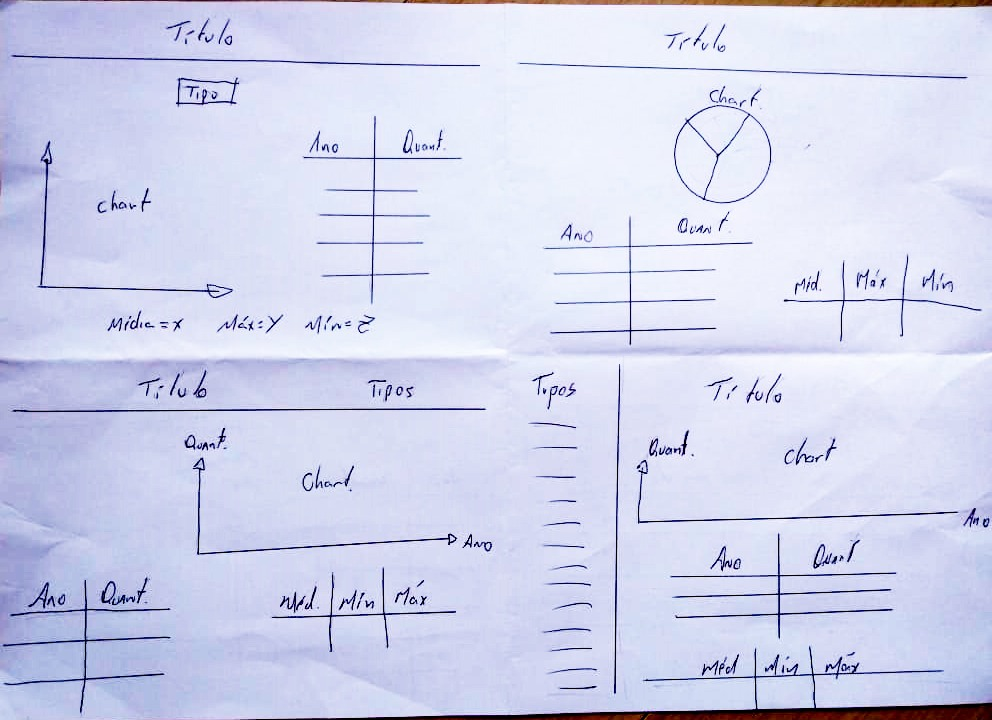
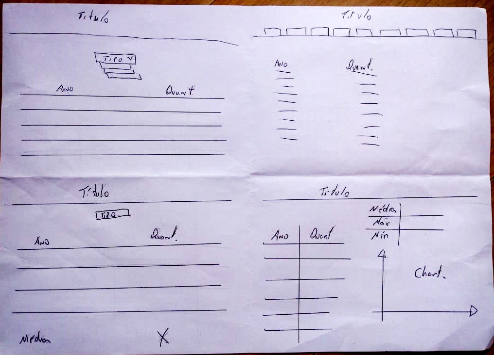
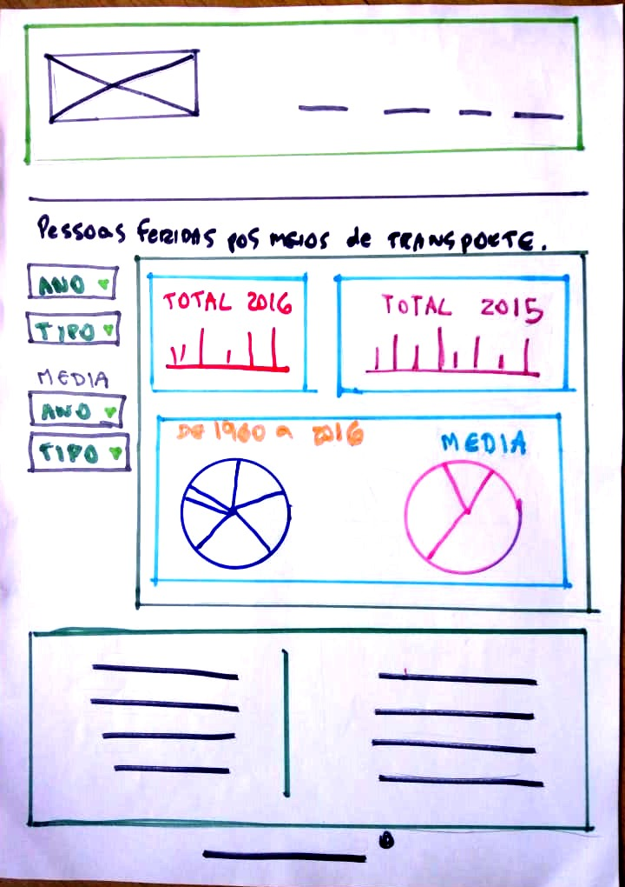

# Data Lovers

[PROJETO](https://scsin.github.io/data-lovers/)


## Resumo do projeto

Neste projeto foi necessário desenvolver uma _página web_ para visualizar um _conjunto (set) de dados_** que se adeque ao que seu usuário necessita.
Foram fornecidas séries de dados de diferentes _temáticas_.
Uma vez definida sua área de interesse, entenda quem é seu usuário e o que ele necessita saber ou ver exatamente; assim já poderá criar uma interface que o ajude a interagir e entender melhor os dados.
Os dados podem ser visualizados na pasta src > data e os temas são os seguintes:

* [Indicadores de desenvolvimento](src/data/worldbank/worldbank.json)
* [Pokémon](src/data/pokemon/pokemon.json)
* [Steam notícias](src/data/steam/steam.json)
* [League of Legends - Challenger leaderboard](src/data/lol/lol.json)
* [Pessoas feridas por meios de transporte nos EUA](src/data/injuries/injuries.json)


```text
.
├── .gitignore
├── index.html
├── README.md
└──src
    ├── favicon.ico
    ├── main.js
    ├── style.css
    ├── assets
    ├── data
    │   ├── injuries
    │   │   ├── injuries.js
    │   │   └── injuries.json
    │   ├── lol
    │   │   ├── lol.js
    │   │   └── lol.json
    │   ├── pokemon
    │   │   ├── pokemon.js
    │   │   └── pokemon.json
    │   ├── steam
    │   │   ├── steam.js
    │   │   └── steam.json
    │   └── worldbank
    │       ├── worldbank.js
    │       └── worldbank.json

```

## Público alvo

    Engenheiros de transporte e mobilidade, vinculados a seguradoras ou órgãos do governo.

## Personas

    Nome: Jon Baker
    Idade: 47 anos
    Nacionalidade: Norte americano
    Estado civil: Separado
    Filhos: 2
    Formação: Graduação: Engenheiro de tráfego, Pós-graduação: Planejamento e Operação de Transportes
    Empresa onde trabalha: CHiPs

    Nome: Frank Poncherello
    Idade: 32 anos
    Nacionalidade: Porto-riquenho
    Estado civil: Solteiro
    Filhos: 0
    Formação: Graduação: Engenheiro de TI
    Empresa onde trabalha: CHiPs

## Empresa

    Qual é o segmento de sua empresa?
    Engenharia de transportes.

## Trabalho

    O que você faz no trabalho?
    Manutenção de sistemas de transporte, monitoramento do fluxo de veículos, definição de sinalização viária, viabilização e planejamento da mobilidade urbana.

    Quais são as ferramentas que você usa diariamente?
    Softwares de organização de dados e análise estatística. Além das diversas opções de softwares gratuitos e pagos como OpenRefine, Tableau Public, Trifacta Wrangler, também faz parte dessa seleção linguagens de programação como R e Python (Numpy, Pandas, Matplotlib).

## Infos e conteúdo

    Quais são os principais fontes de pesquisa para o seu trabalho?
    Census (www.census.gov), DOT (www.transportation.gov).

## Objetivos

    Quais são seus principais objetivos?
    Aperfeiçoamento do tráfego urbano, redução do número de acidentes e consequente melhoria na qualidade de vida.

## Desafios/Problema

    Quais são os maiores desafios em seu trabalho?
    Encontrar dados específicos é uma tarefa complicada devido a escassez de fontes de informações confiáveis e a falta de coerência dos documentos pesquisados.

## Solução

    Trabalhar com dados pode ser algo complexo. O site SaLa Estatística fornece informações de acidentes de transportes de forma rápida e clara,economizando tempo e energia do pesquisador.

## Protótipo




## Testes de usabilidade
    Os testes detectaram problemas nas funcionalidades do protótipo e ajudaram a identificar possíveis melhorias a serem implantadas.

## Versão 0.0.1
    Acesso aos dados injuries.js;
    Armazenamento dos dados em uma array;
    Print dos dados no HTML;

## Versão 0.0.2
    Adição de células dinamicamente;
    Print dos dados year;
    Print dos dados value;
    AddEventListener;

## Versão 0.0.3
    Adição Header, Footer;
    Favicon;
    CSS;

## Índice

* [Preâmbulo](#preâmbulo)
* [Descrição](#resumo-do-projeto)
* [Considerações gerais](#considerações-gerais)
* [Objetivos de aprendizagem](#objetivos-de-aprendizagem)
* [Parte obrigatória](#parte-obrigatória)
* [Parte opcional](#parte-opcional-hacker-edition)
* [Considerações técnicas](#considerações-técnicas)
* [Primeiros passos](#primeiros-passos)
* [Conteúdo de referência](#conteúdo-de-referência)
* [Checklist](#checklist)

***

## Checklist

* [X] Usar VanillaJS.
* [X] Inclui _Definição de produto_ clara e informativa no `README.md`.
* [X] Inclui esboço da solução (protótipo de baixa fidelidade e de alta fidelidade, se houver) no
  `README.md`.
* [X] Inclui a lista de problema detectados através dos testes de usabilidade
  no `README.md`.
* [X] UI: Mostra lista e/ou tabela com dados e/ou indicadores.
* [X] UI: Permite filtrar os dados com base em uma condição.